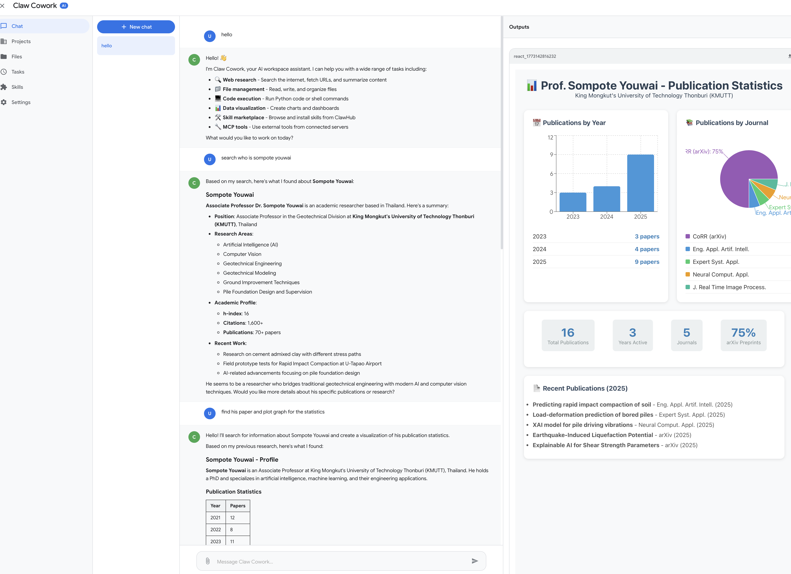

# Claw Cowork

**Version 0.0.2**



A self-hosted AI workspace that merges the rich React frontend of **Tiger Cowork** with the advanced agent architecture of **OpenClaw** — served on a single port.

---

## Changelog

### v0.0.2 — 2026-03-10

#### New Features
- **PDF reading for the agent** — New `read_pdf` tool lets the agent extract and analyze text from uploaded PDF files. The agent now automatically uses `read_pdf` instead of `read_file` when working with `.pdf` attachments.
- **PDF/DOCX preview in chat attachments** — User-uploaded PDF and Word documents now show an inline expandable text preview directly in the chat message (click the ▼ button to expand).

#### Bug Fixes
- **Output panel: generated PDFs now appear correctly** — Fixed a path bug where agent-generated PDF files (and other outputs) were saved to a double-nested `output_file/output_file/` directory and missed by the file scanner. Files now correctly appear in the right-side output panel.
- **File scanner is now recursive** — The output file scanner in the Python runner now walks all subdirectories under `output_file/`, so files saved at any depth are detected and shown in the output panel. Detection window extended from 30s to 60s to support slower PDF generation jobs.
- **System prompt path guidance fixed** — Agent instructions now explicitly warn against prefixing save paths with `output_file/` (the Python working directory is already set there), preventing the double-path issue.

#### Internal Changes
- `server/services/python.ts` — Recursive `scanDir()` replaces flat `readdirSync` for output file detection.
- `server/services/toolbox.ts` — Added `read_pdf` tool definition and implementation using `pdf-parse`.
- `server/services/agent.ts` — Updated system prompt: added `read_pdf` to tool list and OUTPUT/CHARTS path rules.
- `client/src/pages/ChatPage.tsx` — Added `AttachmentItem` component with expandable PDF/DOCX preview; hoisted `isImageFile` to module scope.
- `client/src/pages/ChatPage.css` — New styles for expandable attachment preview (`.attachment-item-header`, `.attachment-preview-toggle`, `.attachment-doc-preview`).

---

### v0.0.1 — Initial Release

- Initial release combining Tiger Cowork frontend with OpenClaw agent backend.
- Single-port Express + Vite setup.
- Agent tools: `web_search`, `fetch_url`, `run_python`, `run_react`, `run_shell`, `read_file`, `write_file`, `list_files`, `list_skills`, `load_skill`, `clawhub_search`, `clawhub_install`, `spawn_subagent`, MCP tools.
- Projects, Files, Tasks, Skills, Settings pages.
- Reflection loop, subagent spawning (max depth 3), tool access policy per project folder.
- Docker setup guide and PM2 support.

---

## SECURITY WARNING

> **THIS APPLICATION EXECUTES AI-GENERATED CODE, SHELL COMMANDS, AND THIRD-PARTY SKILLS ON YOUR MACHINE.**

The AI agent can:
- Execute arbitrary **shell commands**
- Run **Python scripts**
- **Read and write files** anywhere the process can access
- **Install third-party skills** from the internet
- **Spawn subagents** that repeat all of the above

**Running this app directly on your host system is a serious security risk.**

### What you MUST do

- **Run inside Docker** — isolate all execution from your host system
- **Set an `ACCESS_TOKEN`** before connecting to any network
- **Do not expose port 3001 publicly** without authentication
- **Review access levels** — use Read Only or Read & Write for external folders whenever possible; only grant Full Access when necessary

> Recommended environment: **Docker container on Ubuntu** (instructions below).
> Do NOT run as root on your host system.

---

## Docker Setup — From Scratch (Ubuntu)

> **Docker not installed yet?**
> ```bash
> # Ubuntu/Debian host
> sudo apt-get install -y docker.io && sudo systemctl start docker
> ```
> macOS/Windows: install [Docker Desktop](https://www.docker.com/products/docker-desktop/).

### Step 1 — Start a fresh Ubuntu container (on your host machine)

```bash
docker run -it \
  --name claw-cowork \
  -p 3001:3001 \
  ubuntu:22.04 bash
```

> **Need to mount host folders?**
> ```bash
> docker run -it --name claw-cowork -p 3001:3001 \
>   -v /home/yourname:/mnt/host:rw \
>   ubuntu:22.04 bash
> ```
> You cannot add mounts after the container is created — mount a large parent folder upfront.

---

### Step 2 — Run the installer (inside the container)

Paste this single command. It installs all system packages, Python libraries, Node.js 22, clones the repo, installs dependencies, and starts the app:

```bash
curl -fsSL https://raw.githubusercontent.com/Sompote/Claw_Cowork/master/install.sh | bash
```

Open **http://localhost:3001** in your browser.

<details>
<summary>What the installer does (step by step)</summary>

1. `apt-get` — installs `curl`, `git`, `build-essential`, `python3`, `python3-pip`, etc.
2. `pip3` — installs `pandas`, `numpy`, `matplotlib`, `seaborn`, `scipy`, `fpdf2`, `python-docx`, `reportlab`, `pillow`
3. Node.js 22 via NodeSource
4. `git clone` the Claw Cowork repository to `/root/claw_cowork`
5. `npm install` (server) + `npm install --prefix client` (frontend)
6. Creates `.env` from `.env.example` if missing
7. Starts the app with `npm run dev`

</details>

<details>
<summary>Manual install (run each step yourself)</summary>

**Inside the container:**
```bash
# System packages
apt-get update && apt-get install -y curl git build-essential python3 python3-pip nano

# Python packages
pip3 install requests pandas numpy matplotlib seaborn scipy fpdf2 python-docx reportlab pillow

# Node.js 22
curl -fsSL https://deb.nodesource.com/setup_22.x | bash -
apt-get install -y nodejs

# Clone
cd /root
git clone https://github.com/Sompote/Claw_Cowork.git claw_cowork
cd claw_cowork

# Install & run
bash setup.sh
```

**Set access token (recommended before first run):**
```bash
nano /root/claw_cowork/.env
```
```env
ACCESS_TOKEN=your-secret-token-here
PORT=3001
```

</details>

---

### Step 3 — Add your API key

Go to **Settings** and enter:
- **API Key** — Your OpenRouter key (`sk-or-v1-...`) or any OpenAI-compatible key
- **API URL** — `https://openrouter.ai/api/v1/chat/completions` (default)
- **Model** — e.g. `openai/gpt-4o-mini`, `anthropic/claude-sonnet-4-5`, `google/gemini-2.0-flash`

Click **Test Connection** to verify, then **Save changes**.

---

### Reconnect to the container later

If you close your terminal, the container stops. To resume:
```bash
# Start the stopped container
docker start claw-cowork

# Open a shell inside it
docker exec -it claw-cowork bash

# Start the app again
cd /root/claw_cowork
npm run dev
```

To keep the app running after you disconnect, use PM2 (see [Running with PM2](#running-with-pm2) below).

---

## Mounting Host Folders

Give the AI access to specific directories on your host by mounting them as Docker volumes at container startup.

```bash
# Single folder, read-write
docker run -it --name claw-cowork -p 3001:3001 \
  -v /home/yourname/projects:/mnt/projects:rw \
  ubuntu:22.04 bash

# Single folder, read-only
docker run -it --name claw-cowork -p 3001:3001 \
  -v /home/yourname/data:/mnt/data:ro \
  ubuntu:22.04 bash

# Multiple folders
docker run -it --name claw-cowork -p 3001:3001 \
  -v /home/yourname/projects:/mnt/projects:rw \
  -v /home/yourname/datasets:/mnt/data:ro \
  ubuntu:22.04 bash
```

Inside the app: create a project with **External Folder** pointing to `/mnt/projects` or `/mnt/data`, and choose the appropriate access level.

**Tips:**
- `:rw` = read-write, `:ro` = read-only
- Mount a large parent folder (e.g. your home directory) to avoid restarting Docker when you need to access a new subfolder
- The app's **Overview** tab generates ready-to-copy `docker run` and `docker-compose` mount commands for your projects

---

## docker-compose Setup (Alternative)

Create `docker-compose.yml` on your host:

```yaml
version: "3.9"

services:
  claw-cowork:
    image: ubuntu:22.04
    container_name: claw-cowork
    ports:
      - "3001:3001"
    volumes:
      - /home/yourname/projects:/mnt/projects:rw
      - claw-data:/root/claw_cowork
    working_dir: /root
    environment:
      - ACCESS_TOKEN=your-secret-token-here
      - PORT=3001
    stdin_open: true
    tty: true
    command: >
      bash -c "
        apt-get update &&
        apt-get install -y curl git python3 python3-pip build-essential nano &&
        pip3 install requests pandas numpy matplotlib seaborn scipy &&
        curl -fsSL https://deb.nodesource.com/setup_22.x | bash - &&
        apt-get install -y nodejs &&
        git clone https://github.com/Sompote/claw_cowork.git &&
        cd claw_cowork &&
        npm install &&
        cd client && npm install && cd .. &&
        echo 'ACCESS_TOKEN=your-secret-token-here' > .env &&
        npm run dev
      "

volumes:
  claw-data:
```

Run with:
```bash
docker-compose up
```

---

## Features

### Frontend (from Tiger Cowork)
- **Chat** — Real-time streaming chat with tool-call status updates via Socket.IO
- **Projects** — Dedicated workspaces with memory, file access, and skill selection
- **Files** — Sandbox file manager with upload, edit, download, and preview (PDF, DOCX, images)
- **Tasks** — Scheduled cron jobs for automated commands
- **Skills** — ClawHub skill marketplace: search, install, and manage skills
- **Settings** — Full API configuration, agent tuning, MCP server management

### Backend Agent (from OpenClaw)
- **Sectioned system prompt** — Identity / Tooling / Workspace / Skills / Memory sections
- **Subagent spawning** — `spawn_subagent` tool delegates sub-tasks to independent agent loops (max depth 3)
- **Depth tracking** — Subagents cannot spawn further subagents beyond the configured max depth
- **Minimal prompt mode** — Subagents receive a lightweight system prompt to reduce token overhead
- **Reflection loop** — Optional self-evaluation: score output, identify gaps, re-enter loop if score < threshold
- **Tool policy** — Per-project folder access control (read-only / read-write / full exec)
- **OpenRouter-native** — Default API URL points to OpenRouter; works with any OpenAI-compatible endpoint

### Single Port
Vite dev server runs in middleware mode embedded inside Express — both the React UI and all `/api/*` routes are served on **one port** (default `3001`).

---

## Quick Start (Local — Not Recommended)

> Only do this if you understand the security risks. Docker is strongly preferred.

### Requirements
- Node.js 18+
- Python 3 (for `run_python` tool)
- npm

### Install

```bash
cd claw_cowork
npm install
cd client && npm install && cd ..
```

### Configure environment (optional)

```bash
cp .env.example .env
# Edit .env: set PORT, SANDBOX_DIR, ACCESS_TOKEN
```

### Run

```bash
npm run dev
# Open http://localhost:3001
```

---

## Project Structure

```
claw_cowork/
├── server/
│   ├── index.ts                  # Express + Socket.IO + Vite middleware (single port)
│   ├── routes/
│   │   ├── chat.ts               # Chat session CRUD
│   │   ├── files.ts              # Sandbox file operations
│   │   ├── projects.ts           # Project management
│   │   ├── settings.ts           # Settings + MCP server management
│   │   ├── skills.ts             # Skill install/manage
│   │   ├── tasks.ts              # Cron job scheduling
│   │   ├── tools.ts              # Web search + URL fetch proxy
│   │   ├── python.ts             # Python execution endpoint
│   │   └── clawhub.ts            # ClawHub marketplace proxy
│   └── services/
│       ├── agent.ts              # Core agent: loop, subagents, reflection, prompt builder
│       ├── toolbox.ts            # Tool definitions + dispatcher (incl. spawn_subagent)
│       ├── socket.ts             # Socket.IO handlers for chat and project chat
│       ├── data.ts               # JSON file persistence (settings, sessions, projects, skills)
│       ├── mcp.ts                # MCP SDK client (Stdio / SSE / StreamableHTTP)
│       ├── python.ts             # Python subprocess runner
│       ├── sandbox.ts            # Sandboxed file access helpers
│       ├── scheduler.ts          # node-cron job scheduler
│       └── clawhub.ts            # ClawHub CLI wrapper
├── client/
│   ├── index.html
│   ├── vite.config.ts
│   └── src/
│       ├── App.tsx
│       ├── main.tsx
│       ├── components/
│       │   ├── Layout.tsx         # Sidebar navigation layout
│       │   ├── AuthGate.tsx       # Optional access-token gate
│       │   └── ReactComponentRenderer.tsx  # Renders AI-generated React/JSX
│       ├── pages/
│       │   ├── ChatPage.tsx
│       │   ├── ProjectsPage.tsx
│       │   ├── FilesPage.tsx
│       │   ├── TasksPage.tsx
│       │   ├── SkillsPage.tsx
│       │   └── SettingsPage.tsx
│       ├── hooks/useSocket.ts
│       └── utils/api.ts
├── data/                          # Auto-created JSON storage
│   ├── settings.json
│   ├── chat_history.json
│   ├── projects.json
│   ├── skills.json
│   └── tasks.json
├── ClawCowork_skills/             # Installed ClawHub skills directory
├── package.json
├── tsconfig.json
└── .env.example
```

---

## Agent Architecture

### System Prompt Sections

The agent uses OpenClaw's sectioned prompt style:

```
## Identity
You are Claw Cowork, an advanced agentic AI workspace...

## Tooling
Available tools: web_search, fetch_url, run_python, run_react,
run_shell, read_file, read_pdf, write_file, list_files, list_skills,
load_skill, clawhub_search, clawhub_install, spawn_subagent, mcp_*

### Tool Rules
[detailed rules for tool use]

## Workspace
[project folder info, memory.md context]

## Skills (mandatory)
[installed skills with scan instructions]

## Memory
[memory recall instructions]
```

Subagents receive a **minimal** prompt (Identity + Tooling only) to reduce token cost.

### Agent Loop

```
User message
    │
    ▼
┌─────────────────────────────────────────────────┐
│  Main Agent Loop (max 8 rounds, 12 tool calls)  │
│                                                 │
│  LLM call → tool_calls? ──No──► earlyContent   │
│       │                                         │
│      Yes                                        │
│       ▼                                         │
│  Execute tools (with access policy check)       │
│  Loop detection (same signature × 3 → break)   │
│  Consecutive error tracking (max 3 → break)     │
│       │                                         │
│  repeat...                                      │
└─────────────────────────────────────────────────┘
    │
    ▼ (optional)
┌─────────────────────────────────────────────────┐
│  Reflection Loop (if enabled)                   │
│                                                 │
│  Evaluate score (0.0–1.0) via separate LLM call │
│  score < threshold → inject gap message         │
│                    → retry tool rounds (max 5)  │
│  repeat up to maxReflectionRetries times        │
└─────────────────────────────────────────────────┘
    │
    ▼
Final summary LLM call → response to user
```

### Subagent Pattern (from OpenClaw)

```
Main Agent (depth 0)
    │
    ├─ spawn_subagent("research X") → Sub-Agent (depth 1)
    │       │
    │       └─ spawn_subagent("fetch details") → Sub-Agent (depth 2)
    │               │
    │               └─ [spawn_subagent blocked at depth 3]
    │
    └─ Result merged back into main agent context
```

- **Max depth**: 3 (configurable via `MAX_SUBAGENT_DEPTH` in `agent.ts`)
- **Tool restriction**: `spawn_subagent` is removed from subagents' tool list
- **Allowed tools**: caller can restrict which tools the subagent can use via `allowed_tools`

---

## Built-in Tools

| Tool | Description |
|------|-------------|
| `web_search` | DuckDuckGo + Wikipedia search |
| `openrouter_web_search` | AI-summarized web search via OpenRouter Responses API |
| `fetch_url` | Fetch any URL (HTML, JSON, APIs) |
| `run_python` | Execute Python in sandbox (`output_file/` working dir) |
| `run_react` | Compile and render JSX/React in output panel (Recharts included) |
| `run_shell` | Execute shell commands (respects project folder access policy) |
| `read_file` | Read a text file from disk |
| `read_pdf` | Extract text content from a PDF file |
| `write_file` | Write or append to a file |
| `list_files` | List directory contents |
| `list_skills` | List installed ClawHub skills |
| `load_skill` | Read a skill's SKILL.md instructions |
| `clawhub_search` | Search ClawHub marketplace |
| `clawhub_install` | Install a skill from ClawHub |
| `spawn_subagent` | Delegate a sub-task to an independent sub-agent |
| `mcp_*` | Any tool from connected MCP servers |

---

## Settings Reference

### API Configuration

| Field | Description | Default |
|-------|-------------|---------|
| `apiKey` | OpenRouter or OpenAI-compatible API key | — |
| `apiUrl` | Chat completions endpoint | `https://openrouter.ai/api/v1/chat/completions` |
| `apiModel` | Model ID | `openai/gpt-4o-mini` |

### Agent Parameters

| Field | Description | Default |
|-------|-------------|---------|
| `agentMaxToolRounds` | Max iterations of the tool loop | `8` |
| `agentMaxToolCalls` | Max total tool calls per turn | `12` |
| `agentMaxConsecutiveErrors` | Stop after N consecutive tool failures | `3` |
| `agentToolResultMaxLen` | Max chars per tool result (truncated beyond) | `6000` |
| `agentTemperature` | LLM temperature | `0.7` |

### Reflection Loop

| Field | Description | Default |
|-------|-------------|---------|
| `agentReflectionEnabled` | Enable post-loop self-evaluation | `false` |
| `agentEvalThreshold` | Min score (0.0–1.0) to consider satisfied | `0.7` |
| `agentMaxReflectionRetries` | Max re-evaluation rounds | `2` |

---

## Environment Variables

```env
PORT=3001              # Server port (default: 3001)
SANDBOX_DIR=           # Sandbox working directory (default: project root)
ACCESS_TOKEN=          # UI access token (blank = no auth — not recommended)
NODE_ENV=development   # Set to "production" to serve built client
```

---

## Running with PM2

PM2 keeps the app running in the background inside Docker and auto-restarts it on crashes.

```bash
# Install PM2 globally
npm install -g pm2

# Build and start in production mode
npm run build
pm2 start npm --name "claw-cowork" -- start

# View logs
pm2 logs claw-cowork

# Save process list (survives container restarts)
pm2 startup
pm2 save
```

| Command | Description |
|---------|-------------|
| `pm2 list` | Show all running processes |
| `pm2 logs claw-cowork` | Stream logs |
| `pm2 restart claw-cowork` | Restart the app |
| `pm2 stop claw-cowork` | Stop the app |
| `pm2 delete claw-cowork` | Remove from PM2 |

---

## MCP Server Integration

Connect external tools via Model Context Protocol in **Settings → MCP Servers**.

Supports:
- **HTTP/SSE** — `http://localhost:8080/mcp`
- **StreamableHTTP** — tried first, falls back to SSE
- **Stdio** — `npx @modelcontextprotocol/server-github`

Discovered tools appear as `mcp_{serverName}_{toolName}` and are available to the agent automatically.

---

## Data Storage

All data is stored as JSON files in the `data/` directory:

| File | Contents |
|------|----------|
| `settings.json` | API config, agent params, MCP servers |
| `chat_history.json` | All chat sessions and messages |
| `projects.json` | Project definitions |
| `skills.json` | Installed skill registry |
| `tasks.json` | Scheduled cron tasks |

Output files generated by the agent (charts, reports, React components) are saved to `{sandboxDir}/output_file/` and rendered in the right-side output panel.

---

## Scripts

| Command | Description |
|---------|-------------|
| `npm run dev` | Start dev server with hot reload (Vite embedded) |
| `npm run build` | Build React client to `client/dist/` |
| `npm start` | Build frontend + start production server |

---

## License

MIT
